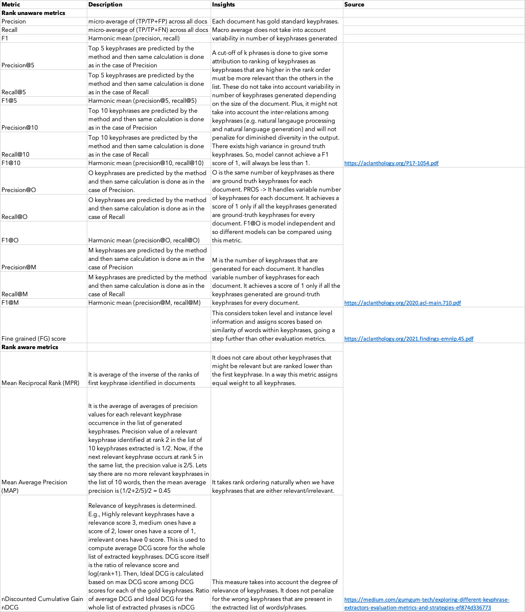

  
Keyphrase extraction has become an important NLP task which has been used in several applications, such as Text Summarization, Text Generation, Question and Answering, Reading Comprehension, Opinion Mining, and Information Retrieval. It becomes important to evaluate the performance of this task on a robust evaluation metric. For this purpose, I have identified 19 evaluation metrics for keyword/keyphrase extraction, summarized in the tabular format.

